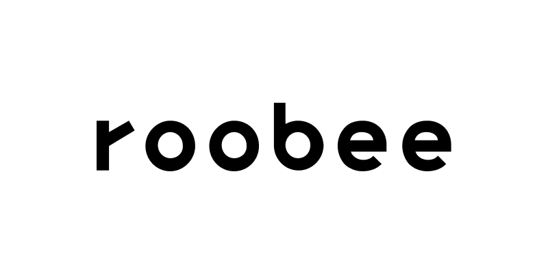

# Roobee Token

  

# Dependencies

## Roobee

### Basic information
ERC20 token

Token Smart contract is a subject to independent third-party technological audit from credible experts before the launch to ensure the security and integrity of the code. The ROOBEE token is a utility token what is confirmed by our legal advisors. Additional emission of ROOBEE tokens is not allowed by smart contract.

Token Parameter | Value
------------ | -------------
Token name	| Roobee
Symbol 	 | Roobee
Decimals |	18
Max token amount to issue | 5 400 000 000
Freeze tokens |	yes
Emission Type | Mintable
### Token Distribution

Percent of Tokens | Goal
----------------- | -------------
54%  | will be minted for sale and distributed among investors.
15% | will be minted and distributed among the founders and the project team with a lockup period of 1 year and subsequent unlock of 10% of volume each 30 days.
10% | will be minted to reward pool used for compensation to participants of affiliate program for service promotion and attraction of new clients, as well as reward to customers using the gaming elements of the service.
13% | will be minted for the reserve fund.
4% | will be minted to advisers, consultants and strategic partners with a lockup period of 6 months and subsequent unlock of 10% of volume each 30 days.
4% | will be minted for airdrops and other promo-activities for project popularization.
